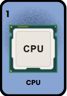

# Loteria Mexicana sobre las computadoras JS CCS y Nodes

<p align="center">
  
</p>

<p align="center">
  <b>Un juego multijugador en tiempo real inspirado en la Lotería Mexicana tradicional, adaptado con conceptos de Arquitectura de Computadoras y una estética divertida.</b>
</p>

<p align="center">
  
  
  
  
</p>

---

## 🎮 Características del Juego
* **Multijugador en tiempo real:** Salas privadas mediante códigos alfanuméricos gestionadas con WebSockets (`Socket.io`).
* **Mazo de Cómputo:** 40 cartas temáticas (CPU, Memoria RAM, ALU, Kernel, Buses, etc.) con locución de voz sintetizada en español latino (gTTS).
* **Modos de Juego Variados:** Línea recta, 4 esquinas, el centro y tabla llena.
* **Caja Misteriosa (Power-Ups):** Sistema dinámico estilo Mario Kart que otorga habilidades tácticas como *El Oráculo*, *Firewall*, *El Hacker*, *Glitch* y *Apagón*.

## 🚀 Despliegue e Instalación Local

Si deseas correr el proyecto en tu máquina local para realizar pruebas:

1. **Clona el repositorio:**
   ```bash
   git clone [https://github.com/bryanjavv/loteria-computo.git](https://github.com/bryanjavv/loteria-computo.git)
   cd loteria-computo
